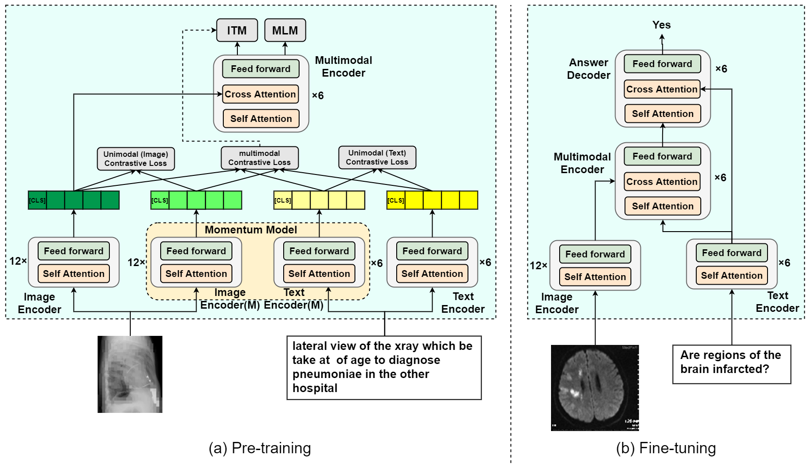
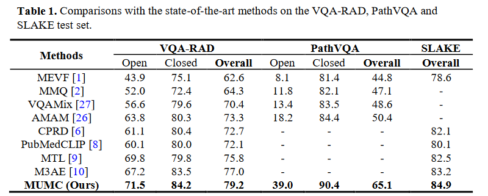

# MUMC
## [Masked Vision and Language Pre-training with Unimodal and Multimodal Contrastive Losses for Medical Visual Question Answering](https://arxiv.org/abs/2307.05314)
This is the official implementation of `MUMC` for the medical visual question answering, which was accepted by [MICCAI-2023](https://conferences.miccai.org/2023/en/default.asp).
Our proposal achieves superior accuracy in comparison with other state-of-the-art (sota) methods on three public medical VQA datasets: [VQA-RAD dataset](https://www.nature.com/articles/sdata2018251#data-citations), [PathVQA dataset](https://arxiv.org/abs/2003.10286) and [Slake dataset](https://arxiv.org/abs/2102.09542). Paper link [here](https://link.springer.com/chapter/10.1007/978-3-031-43907-0_36).

This repository is based on our previous [work](https://github.com/pengfeiliHEU/M2I2) and inspired by @Junnan Li's [work](https://github.com/salesforce/ALBEF). We sincerely thank for their sharing of the codes.

<div align=center>

</div>
<center>Figure 1: Overview of the proposed MUMC model. </center>

## Requirements
Run the following command to install the required packages:
```bash
pip install -r requirements.txt
```

## Training and Testing
### 1. Dataset Preparation
Please organize the datasets as the following structure:
```angular2
+--clef2022
| +--train
| | +--ImageCLEFmedCaption_2022_train_000001.jpg
| | +--ImageCLEFmedCaption_2022_train_000002.jpg
| | +--...
| +--valid
| | +--ImageCLEFmedCaption_2022_valid_084258.jpg
| | +--ImageCLEFmedCaption_2022_valid_084259.jpg
| | +--...
| +--clef22022_train.json
| +--clef22022_valid.json

+--data_RAD
| +--images
| | +--synpic100132.jpg
| | +--synpic100176.jpg
| | +--...
| +--trainset.json
| +--testset.json
| +--answer_list.json

+--data_PathVQA
| +--images
| | +--train
| | | +--train_0000.jpg
| | | +--train_0001.jpg
| | | +--...
| | +--val
| | | +--val_0000.jpg
| | | +--val_0001.jpg
| | | +--...
| | +--test
| | | +--test_0000.jpg
| | | +--test_0001.jpg
| | | +--...
| +--pathvqa_test.json
| +--pathvqa_train.json
| +--pathvqa_val.json
| +--answer_trainval_list.json

+--data_Slake
| +--imgs
| | +--xmlab0
| | | +--source.jpg.jpg
| | | +--question.json
| | | +--...
| | +--....
| +--slake_test.json
| +--slake_train.json
| +--slake_val.json
| +--answer_list.json
```
### 2. Pre-training
```angular2
python3 pretrain  --output_dir ./pretrain
```

### 3. Finetune on Medical VQA tasks
```angular2
# choose medical vqa dataset(rad, pathvqa, slake)
python3 train_vqa.py --dataset_use rad --checkpoint ./pretrain/med_pretrain_29.pth  --output_dir ./output/rad
```

## Comparison with the sota


## Pretrained weights
You can download the pre-trained weights through the following [link](https://drive.google.com/file/d/1ZxwjfDeBYTMpw4mN_R9-gAcR9UOJiAFb/view?usp=sharing).

## Citation:
```
@article{MUMC,
  title     = {Masked Vision and Language Pre-training with Unimodal and Multimodal Contrastive Losses for Medical Visual Question Answering},
  author    = {Pengfei Li, Gang Liu, Jinlong He, Zixu Zhao and Shenjun Zhong},
  booktitle = {Medical Image Computing and Computer Assisted Intervention -- MICCAI 2023},
  year      = {2023},
  pages     = {374--383},
  publisher = {Springer Nature Switzerland}
}
```

## License
MIT License
